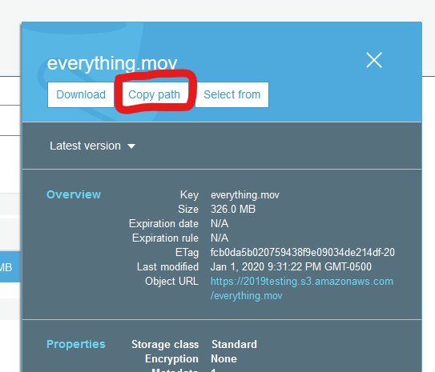

# Testing Your Model

These steps are for testing your model in SageMaker, before you load it onto your Raspberry Pi with Google Coral. It will use your model to annotate a video, and output the video for you to view. This is useful if you think you may have under or over fitted, or if you think you may not have enough data to develop a strong model.

1. Open `Training jobs` on the far left. Open the most recent job.
2. Once the model is done training (the job says `Completed`), scroll to the bottom inside the training job. Copy on the link in the `Output` section, where it says `S3 model artifact`.

3. In SageMaker, click Start on the notebook you have already created if it does not say "In Service".
4. Once the notebook is "In Service", open it using the JupyterLab option. 
5. Open the `DetectCoral` folder, and then `testing.ipynb` this time. These can be found on the left side of the screen. We've noticed that the first time a notebook is opened that it doesn't work correctly. To fix this, follow these steps:
   - Reload the tab. Dismiss the error. When prompted, select the kernel `conda_amazonei_tensorflow_p36`
   - If the tab does not finish reloading, close the tab, and open the notebook in JupyterLab once again. It will work this time.
6. In the code block, replace the string value of `model` with the link you copied in step 2.
7. If you want to test your model with a different video than the current value of `video`, follow these steps:
    - Open AWS S3 by searching for the service in the `Services` dropdown.
    - Create a new bucket by giving it a unique name. Hit next until you reach the `Set permissions` page. On the third page, make sure it has public read permissions if multiple accounts will be using this data. 
    - Once you've made the bucket, go into the bucket, then `Permissions` --> `Access Control List`. Then change the public access to allow `List objects` and `Read bucket permissions`. 
    - Upload the video file that you wish to use into the new S3 bucket. Click "Add files", then select the file, click "Next", then make sure it also has public read permissions if multiple accounts will be using this video. Keep the file properties "Standard", and then click "Upload" 
    - Click on the video after it is done uploading, then click `Copy Path`. 
    - Go back into the notebook in SageMaker, and replace the string value of `model` with the path you copied in the last step.
8. Run the code block by clicking the play button at the top of your screen. This block may take several hours to finish annotating your video.
9. Go back to SageMaker. Open `Training jobs` on the far left. Open the most recent training job.
10. Once the model is done training (the job says `Completed`), scroll to the bottom inside the training job. Click on the link in the `Output` section, where it says `S3 model artifact`.
11. Click on `model.tar.gz`. Click on `Download`.
12. Using an extraction tool (like 7Zip if you have Windows), extract the file you just downloaded. Then, view `inference.avi` that is inside of it. Frames should look like the one below, but for the 2020 game.

### When you are ready to run your model on a Raspberry Pi with Google Coral, [continue to Inference with the Google Coral.](inference.md)

