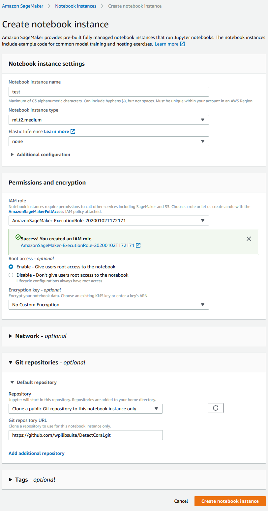

# Training

Training on AWS with the provided dataset should take about 2 hours and cost roughly $1. If you add more images or add new labeling classes the cost and time will be higher.

#### Training with AWS
1. If you are not in the AWS Console main page, click the `AWS` logo in the top left if you're logged in, or go to the page through your [awseducate.com classroom](https://www.awseducate.com) if you are not logged in.
2. Search "SageMaker" in the "Find Services" field,  and create a new notebook instance   The notebook instance should have the following characteristics:
 
 - Notebook instance name: Give your notebook a name
 - IAM Role: Click `Create a new role` inside of the dropdown. Let it have access to Any S3 bucket.
 - Git repositories: open the panel, then click on where it says `None`. Click `Clone a public Git repository to this notebook instance only`, then paste in this link: [https://github.com/wpilibsuite/DetectCoral.git](https://github.com/wpilibsuite/DetectCoral.git)
 - Create the instance
3. After several minutes, the notebook will be "In Service". Open the notebook using the JupyterLab option. 
4. Open the `CoralSagemaker` folder, and then `coral.ipynb`, found on the left side of the screen. We've noticed that the first time a notebook is opened that it doesn't work correctly. To fix this, follow these steps:
   - Reload the tab. Dismiss the error. When prompted, select the kernel `conda_amazonei_tensorflow_p36`
   - If the tab does not finish reloading, close the tab, and open the notebook in JupyterLab once again. It will work this time.
5. Replace `estimator.fit(s3://wpilib)` with `estimator.fit(s3://<<your-bucket-name>>)`. If you could not access Supervisely in earlier steps, do not replace the bucket's name.
6. Run the code block by clicking the play button at the top of your screen. This block will take roughly 15 minutes or less to train your model.
7. Stop the notebook after you are done running it to stop getting charged. Do this by going back to the SageMaker tab, clicking on `Notebook instances` on the far left, selecting the instance that is no longer needed, and selecting `Actions -> Stop`. 
8. Open `Training jobs` on the far left. Open the most recent job.
9. Once the model is done training (the job says `Completed`), scroll to the bottom inside the training job. Click on the link in the `Output` section, where it says `S3 model artifact`.
10. Click on `model.tar.gz`. Click on `Download`.

## [Continue to Inference](inference.md)